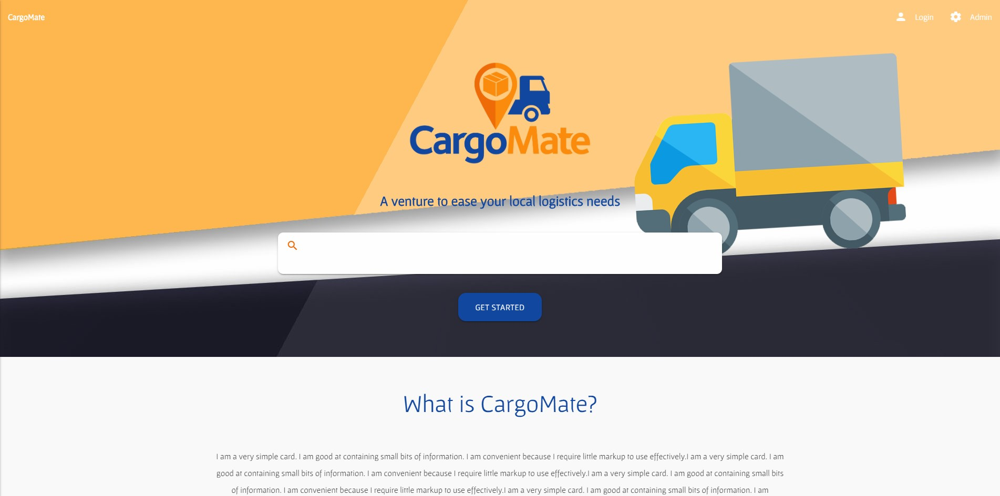
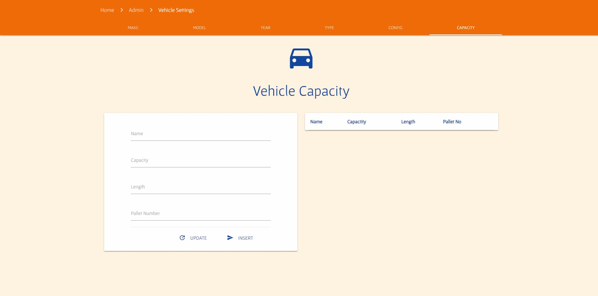

# MaterializeCSS Website
This was a sample project for me to work with a **framework** for web design & development. Mind you, the website is not complete. 

I made use of [materializecss](https://materializecss.com/ "materializecss") framework & learnt many things while doing so, especially the resposive UI. This project was made over 3 years ago & now looking back at it, I can't help but laugh as to how I  tackled many issues with really stupid method and practices. xD

  > HomePage with Parallax Effect & resposive top bar
  

  > Admin Page with options to choose & upload to (also responsive)
  
###### This project was just for learning experiences & was worked on over 3 years ago now
